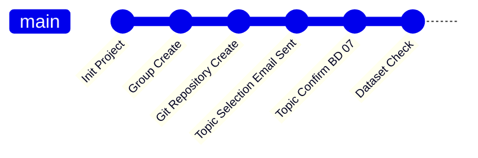

# :large_orange_diamond:COMP4107 Big Data Coursework Group 2

**:large_orange_diamond:COMP4107 Big Data Coursework**  
&emsp;&emsp;&#x2523;&#x2501;&ensp;[:large_blue_diamond:Introduction](#large_blue_diamondintroduction)  
&emsp;&emsp;&#x2523;&#x2501;&ensp;[:large_blue_diamond:Topic](#large_blue_diamondtopic)  
&emsp;&emsp;&#x2523;&#x2501;&ensp;[:large_blue_diamond:Progress](#large_blue_diamondprogress)    
&emsp;&emsp;&#x2503;&emsp;&emsp;&ensp;&#x2514;&ensp;[:hourglass:TO DO](#hourglassto-do)  
&emsp;&emsp;&#x2523;&#x2501;&ensp;[:large_blue_diamond:Documents](#large_blue_diamonddocuments)  
&emsp;&emsp;&#x2503;&emsp;&emsp;&ensp;&#x251C;&ensp;[:file_folder:Coursework Specification](#file_foldercoursework-specification)  
&emsp;&emsp;&#x2503;&emsp;&emsp;&ensp;&#x251C;&ensp;[:file_folder:Templates](#file_foldtemplates)  
&emsp;&emsp;&#x2503;&emsp;&emsp;&ensp;&#x251C;&ensp;[:file_folder:Cheatsheet](#file_foldcheatsheet)  
&emsp;&emsp;&#x2503;&emsp;&emsp;&ensp;&#x251C;&ensp;[:file_folder:Documentation](#file_folddocumentation)  
&emsp;&emsp;&#x2503;&emsp;&emsp;&ensp;&#x2514;&ensp;[:file_folder:Resource](#file_foldresource)  
&emsp;&emsp;&#x2523;&#x2501;&ensp;[:large_blue_diamond:Dataset](#large_blue_diamonddataset)  
&emsp;&emsp;&#x2503;&emsp;&emsp;&ensp;&#x2514;&ensp;[:package:Airline Delay Analysis](#packageairline-delay-analysis)  
&emsp;&emsp;&#x2523;&#x2501;&ensp;[:large_blue_diamond:Methods](#large_blue_diamondmethods)  
&emsp;&emsp;&#x2517;&#x2501;&ensp;[:large_blue_diamond:Reports](#large_blue_diamondreports)  

## :large_blue_diamond:Introduction
This is the repository for UNNC Big Data Coursework Group 2`(COMP4107)`.

The course information are:
- **Big Data**
- COMP4107
- UNNC 2023 Final Year Module

The members of the **`Group 2`** are:
- :student:**Ran JI** 20217337
  :mailbox:scyrj1@nottingham.edu.cn
- :student:**Yik LAU** 20217531
  :mailbox:scyyl18@nottingham.edu.cn
- :student:**Jiarui LI** 20216422 `Group Leader`
  :mailbox:scyjl6@nottingham.edu.cn

This coursework is supervised by:

:man_teacher:Professor Zheng LU.

## :large_blue_diamond:Topic
Preference ranking:
- :green_circle:**BD07** An Optimised Classification for Flight Status
- :bookmark:~~**BD09** Analysis the Impact of Green Infrastructure on Carbon Monoxide Reduction~~
- :bookmark:~~**BD05** Climate Change Analysis in Brazil~~

**Final Decision**: :bookmark:**BD07** `An Optimised Classification for Flight Status`

## :large_blue_diamond:Progress

### :hourglass:TO DO
- :white_check_mark: Topic Preparing
  - [x] Send Topic Choose Email
  - [x] Confirm Topic
  - [x] Collect Topic Basic Information
  - [x] Team GitHub Init
  - [x] Team Chat Group Init
- :hourglass: Coursework Preparing
  - [ ] Schedule Prepare
  - [ ] Environment Prepare
  - [ ] Topic Discuss

## :large_blue_diamond:Documents
### :file_folder:Coursework Specification
:file_folder:[Coursework for COMP4107 Big Data.pdf](./docs/Coursework%20for%20COMP4107%20Big%20Data.pdf) `Update: 2023/04/08`
### :file_folder:Templates
#### Report Template
:file_folder:[Conference-LaTeX-template.zip](./docs/Templates/Conference-LaTeX-template.zip) `Update: 2023/04/08` `LaTeX`

Related Document: :file_folder:[IEEEtran_HOWTO.pdf](./docs/Templates/IEEEtran_HOWTO.pdf)

#### Representation Slide Template
:file_folder:[CW presenation -Template.pptx](./docs/Templates/CW%20presenation%20-Template.pptx) `Update: 2023/04/08` `pptx`

### :file_folder:Cheatsheet
- :spiral_notepad:[Spark Cheatsheet](https://www.datacamp.com/cheat-sheet/pyspark-cheat-sheet-spark-in-python)
- :spiral_notepad:[Python Cheatsheet](https://www.pythoncheatsheet.org/)
- :spiral_notepad:[Pandas Cheatsheet](https://www.datacamp.com/cheat-sheet/pandas-cheat-sheet-for-data-science-in-python)
- :spiral_notepad:[Numpy Cheatsheet](https://www.datacamp.com/cheat-sheet/numpy-cheat-sheet-data-analysis-in-python)
- :spiral_notepad:[Matplotlib Cheatsheet](https://matplotlib.org/cheatsheets/)
- :spiral_notepad:[PyTorch Cheatsheet](https://pytorch.org/tutorials/beginner/ptcheat.html)
### :file_folder:Documentation
- :notebook:[Python Documentation `3.11.3`](https://docs.python.org/3/)
- :notebook:[Spark Documentation `3.3.2`](https://spark.apache.org/docs/latest/)
- :notebook:[PyTorch Documentation `2.0`](https://pytorch.org/docs/stable/index.html)

### :file_folder:Resource
#### ICON
- :framed_picture:[UNNC ICON](./imgs/UoN_Primary_Logo_RGB.png)

## :large_blue_diamond:Dataset
### :package:Airline Delay Analysis
#### :link: Dataset Link
- [:link:  Kaggle Dataset](https://www.kaggle.com/datasets/sherrytp/airline-delay-analysis)
- [:link:  Bureau of Transportation Statistics (Original Dataset)](https://www.transtats.bts.gov/Tables.asp?DB_ID=120&DB_Name=Airline%20On-Time%20Performance%20Data&DB_Short_Name=On-Time)
#### Introduction
The datasets contain daily airline information covering from flight information, carrier company, to taxing-in, taxing-out time, and generalized delay reason of exactly 10 years, from 2009 to 2019. The DOT's database is renewed from 2018, so there might be a minor change in the column names.

#### Files
- :open_file_folder: airline delay analysis `2GB`
  - :spiral_notepad: 20.csv
  - :spiral_notepad: 2009.csv
  - :spiral_notepad: 2010.csv
  - :spiral_notepad: 2011.csv
  - :spiral_notepad: 2012.csv
  - :spiral_notepad: 2013.csv
  - :spiral_notepad: 2014.csv
  - :spiral_notepad: 2015.csv
  - :spiral_notepad: 2016.csv
  - :spiral_notepad: 2017.csv
  - :spiral_notepad: 2018.csv
  - :spiral_notepad: 2019.csv
#### Dataset Schema
|Column|Table Token      |Type                |Description|
|:----:|:----------------|:-------------------|:----------|
|1     |FL_DATE          |`Date` (YYYY-MM-DD) |Flight Date |
|2     |OP_CARRIER       |`String`            |Unique Carrier Code. When the same code has been used by multiple carriers, a numeric suffix is used for earlier users, for example, PA, PA(1), PA(2). Use this field for analysis across a range of years. |
|3     |OP_CARRIER_FL_NUM|`Integer`           |An identification number assigned by US DOT to identify a unique airline (carrier). A unique airline (carrier) is defined as one holding and reporting under the same DOT certificate regardless of its Code, Name, or holding company/corporation.|
|4     |ORIGIN           |`String`            |Origin Airport|
|5     |DEST             |`String`            |Destination Airport|
|6     |CRS_DEP_TIME     |`Integer` (hhmm)    |CRS Departure Time (local time: hhmm) |
|7     |DEP_TIME         |`Integer` (hhmm)    |Actual Departure Time (local time: hhmm)|
|8     |DEP_DELAY        |`Integer`           |Difference in minutes between scheduled and actual departure time. Early departures show negative numbers.|
|9     |TAXI_OUT         |`Integer` (hhmm)    |Taxi Out Time, in Minutes|
|10    |WHEELS_OFF       |`Integer` (hhmm)    |Wheels Off Time (local time: hhmm)|
|11    |WHEELS_ON        |`Integer` (hhmm)    |Wheels On Time (local time: hhmm)|
|12    |TAXI_IN          |`Integer` (hhmm)    |Taxi In Time, in Minutes|
|13    |CRS_ARR_TIME     |`Integer` (hhmm)    |CRS Arrival Time (local time: hhmm)|
|14    |ARR_TIME         |`Integer` (hhmm)    |Actual Arrival Time (local time: hhmm)|
|15    |ARR_DELAY        |`Integer`           |Difference in minutes between scheduled and actual arrival time. Early arrivals show negative numbers.|
|16    |CANCELLED        |`Integer` (0,1)     |Cancelled Flight Indicator (1=Yes)|
|17    |CANCELLATION_CODE|`Char` (A,B,C,D)    |Specifies The Reason For Cancellation, A:Carrier, B:Weather, C:National Air System, D:Security|
|18    |DIVERTED         |`Integer` (0,1)     |Diverted Flight Indicator (1=Yes)|
|19    |CRS_ELAPSED_TIME |`Integer`           |CRS Elapsed Time of Flight, in Minutes|
|20    |ACTUAL_ELAPSED_TIME|`Integer`           |Elapsed Time of Flight, in Minutes|
|21    |AIR_TIME         |`Integer`           |Flight Time, in Minutes|
|22    |DISTANCE         |`Integer`           |Distance between airports (miles)|
|23    |CARRIER_DELAY    |`Integer`           |Carrier Delay, in Minutes|
|24    |WEATHER_DELAY    |`Integer`           |Weather Delay, in Minutes|
|25    |NAS_DELAY        |`Integer`           |National Air System Delay, in Minutes|
|26    |SECURITY_DELAY   |`Integer`           |Security Delay, in Minutes|
|27    |LATE_AIRCRAFT_DELAY|`Integer`           |Late Aircraft Delay, in Minutes|

#### Terminology
|Terminology|Abbreviation|Description|Link|
|:----------|:-----------|:----------|:---|
|Computerized Reservations Systems|**`CRS`**|A computer reservation system or a central reservation system (CRS) is a web-based software used by travel agencies and travel management companies to retrieve and conduct transactions related to air travel, hotels, car rental, or other activities.|[WIKIPEDIA](https://en.wikipedia.org/wiki/Computer_reservation_system)|
|National Air System|**`NAS`**|The National Airspace System (NAS) is the airspace, navigation facilities and airports of the United States along with their associated information, services, rules, regulations, policies, procedures, personnel and equipment.|[WIKIPEDIA](https://en.wikipedia.org/wiki/National_Airspace_System)|
#### Related Datasheet
- Airport Code Lookup Table: `CSV` [:spiral_notepad: L_AIRPORT.csv](./datasets/L_AIRPORT.csv)
- Airline Carriers Code Lookup Table: `CSV` [:spiral_notepad: L_UNIQUE_CARRIERS.csv](./datasets/L_UNIQUE_CARRIERS.csv)

## :large_blue_diamond:Methods
_TBD_
## :large_blue_diamond:Reports
_TBD_

  
  
  
  

