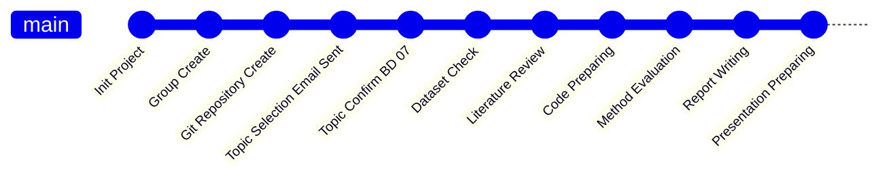
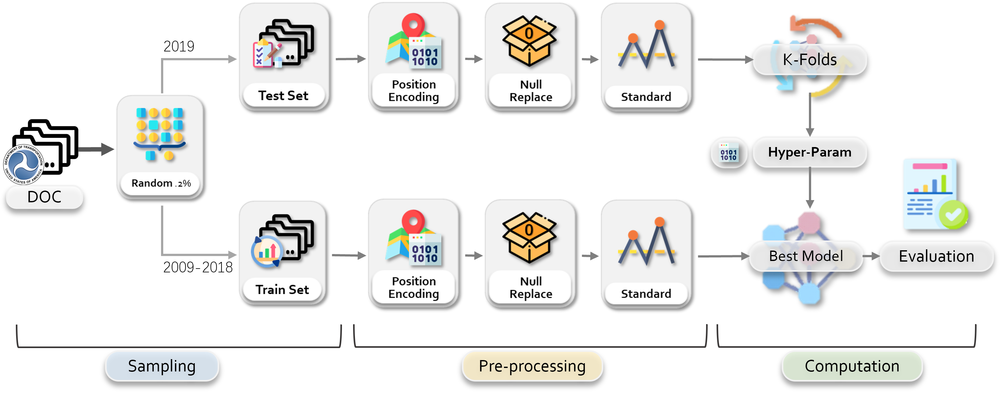
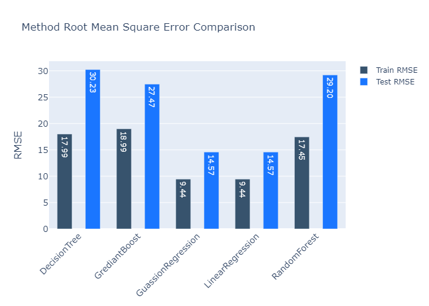
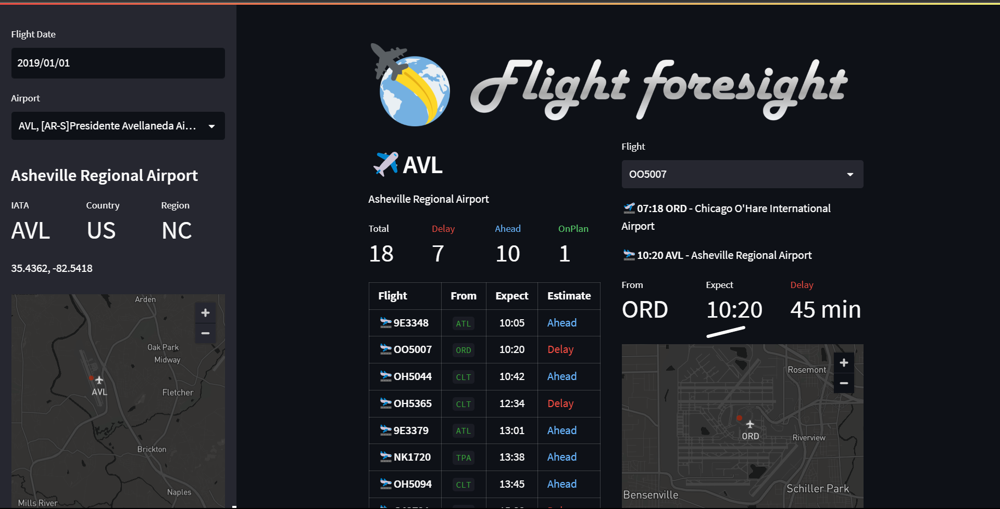

&ensp;

# :large_orange_diamond:COMP4107 Big Data Coursework Group 2
<div style="padding: 1rem; border-radius: 10pt;">
  <a href="https://www.python.org/">
    
  </a>
  &emsp;
  <a href="https://spark.apache.org/">
    
  </a>
  &emsp;
  <a href="https://numpy.org/">
    
  </a>
  &emsp;
  <a href="https://www.kaggle.com/">
    
  </a>
  <a href="https://streamlit.io/">
    
  </a>
</div>

**:large_orange_diamond:COMP4107 Big Data Coursework**  
&emsp;&emsp;&#x2523;&#x2501;&ensp;[:large_blue_diamond:Introduction](#large_blue_diamondintroduction)  
&emsp;&emsp;&#x2523;&#x2501;&ensp;[:large_blue_diamond:Topic](#large_blue_diamondtopic)  
&emsp;&emsp;&#x2523;&#x2501;&ensp;[:large_blue_diamond:Progress](#large_blue_diamondprogress)    
&emsp;&emsp;&#x2503;&emsp;&emsp;&ensp;&#x2514;&ensp;[:hourglass:TO DO](#hourglassto-do)  
&emsp;&emsp;&#x2523;&#x2501;&ensp;[:large_blue_diamond:Documents](#large_blue_diamonddocuments)  
&emsp;&emsp;&#x2503;&emsp;&emsp;&ensp;&#x251C;&ensp;[:file_folder:Coursework Specification](#file_foldercoursework-specification)  
&emsp;&emsp;&#x2503;&emsp;&emsp;&ensp;&#x251C;&ensp;[:file_folder:Templates](#file_foldtemplates)  
&emsp;&emsp;&#x2503;&emsp;&emsp;&ensp;&#x251C;&ensp;[:file_folder:Cheatsheet](#file_foldcheatsheet)  
&emsp;&emsp;&#x2503;&emsp;&emsp;&ensp;&#x251C;&ensp;[:file_folder:Documentation](#file_folddocumentation)  
&emsp;&emsp;&#x2503;&emsp;&emsp;&ensp;&#x2514;&ensp;[:file_folder:Resource](#file_foldresource)  
&emsp;&emsp;&#x2523;&#x2501;&ensp;[:large_blue_diamond:Dataset](#large_blue_diamonddataset)  
&emsp;&emsp;&#x2503;&emsp;&emsp;&ensp;&#x2514;&ensp;[:package:Airline Delay Analysis](#packageairline-delay-analysis)  
&emsp;&emsp;&#x2523;&#x2501;&ensp;[:large_blue_diamond:Methods](#large_blue_diamondmethods)  
&emsp;&emsp;&#x2523;&#x2501;&ensp;[:large_blue_diamond:Codes](#large_blue_diamondcodes)  
&emsp;&emsp;&#x2503;&emsp;&emsp;&ensp;&#x251C;&ensp;[:package:Pre-requisite](#package-pre-requisite)  
&emsp;&emsp;&#x2503;&emsp;&emsp;&ensp;&#x251C;&ensp;[:package:Packages](#package-packages)  
&emsp;&emsp;&#x2503;&emsp;&emsp;&ensp;&#x2514;&ensp;[:package:Tasks](#package-tasks)  
&emsp;&emsp;&#x2517;&#x2501;&ensp;[:large_blue_diamond:Report](#bookreport)


## :large_blue_diamond:Introduction
This is the repository for UNNC Big Data Coursework Group 2`(COMP4107)`.

The course information are:
- **Big Data**
- COMP4107
- UNNC 2023 Final Year Module

The members of the **`Group 2`** are:
- :student:**Ran JI** 20217337
  :mailbox:scyrj1@nottingham.edu.cn
- :student:**Yik Lun Yelan LAU** 20217531
  :mailbox:scyyl18@nottingham.edu.cn
- :student:**Jiarui LI** 20216422 `Group Leader`
  :mailbox:scyjl6@nottingham.edu.cn

This coursework is supervised by:

:man_teacher:Professor Zheng LU.

## :large_blue_diamond:Topic
Preference ranking:
- :green_circle:**BD07** An Optimised Classification for Flight Status
- :bookmark:~~**BD09** Analysis the Impact of Green Infrastructure on Carbon Monoxide Reduction~~
- :bookmark:~~**BD05** Climate Change Analysis in Brazil~~


**Final Decision**: :bookmark:**BD07** `An Optimised Classification for Flight Status`

## :large_blue_diamond:Progress

### :hourglass:TO DO
- :white_check_mark: Topic Preparing
  - [x] Send Topic Choose Email
  - [x] Confirm Topic
  - [x] Collect Topic Basic Information
  - [x] Team GitHub Init
  - [x] Team Chat Group Init
- :white_check_mark: Coursework Preparing
  - [x] Schedule Prepare
  - [x] Environment Prepare
  - [x] Topic Discuss
- :white_check_mark: Coding and Project
  - [x] Prepare basic lib
  - [x] Implement different models
  - [x] Evaluate the models
  - [x] Draw graphs
  - [x] Prepare visulization client
- :white_check_mark: Report Writing
  - [x] Literature Review
  - [x] Introduction
  - [x] Methods
  - [x] Conclusion
  - [x] Integration
- :hourglass: Presentation
  - [x] Slides preparing
  - [ ] Practice
  - [ ] Final Presentation

## :large_blue_diamond:Documents
### :file_folder:Coursework Specification
:file_folder:[Coursework for COMP4107 Big Data.pdf](./docs/Coursework%20for%20COMP4107%20Big%20Data.pdf) `Update: 2023/04/08`
### :file_folder:Templates
#### Report Template
:file_folder:[Conference-LaTeX-template.zip](./docs/Templates/Conference-LaTeX-template.zip) `Update: 2023/04/08` `LaTeX`

Related Document: :file_folder:[IEEEtran_HOWTO.pdf](./docs/Templates/IEEEtran_HOWTO.pdf)

#### Representation Slide Template
:file_folder:[CW presenation -Template.pptx](./docs/Templates/CW%20presenation%20-Template.pptx) `Update: 2023/04/08` `pptx`

### :file_folder:Cheatsheet
- :spiral_notepad:[Spark Cheatsheet](https://www.datacamp.com/cheat-sheet/pyspark-cheat-sheet-spark-in-python)
- :spiral_notepad:[Python Cheatsheet](https://www.pythoncheatsheet.org/)
- :spiral_notepad:[Pandas Cheatsheet](https://www.datacamp.com/cheat-sheet/pandas-cheat-sheet-for-data-science-in-python)
- :spiral_notepad:[Numpy Cheatsheet](https://www.datacamp.com/cheat-sheet/numpy-cheat-sheet-data-analysis-in-python)
- :spiral_notepad:[Matplotlib Cheatsheet](https://matplotlib.org/cheatsheets/)
- :spiral_notepad:[PyTorch Cheatsheet](https://pytorch.org/tutorials/beginner/ptcheat.html)
### :file_folder:Documentation
- :notebook:[Python Documentation `3.11.3`](https://docs.python.org/3/)
- :notebook:[Spark Documentation `3.3.2`](https://spark.apache.org/docs/latest/)
- :notebook:[PyTorch Documentation `2.0`](https://pytorch.org/docs/stable/index.html)

### :file_folder:Resource
#### ICON
- :framed_picture:[UNNC ICON](./imgs/UoN_Primary_Logo_RGB.png)


## :large_blue_diamond:Dataset
### :package:Airline Delay Analysis
#### :link: Dataset Link
- [:link:  Kaggle Dataset](https://www.kaggle.com/datasets/sherrytp/airline-delay-analysis)
- [:link:  Bureau of Transportation Statistics (Original Dataset)](https://www.transtats.bts.gov/Tables.asp?DB_ID=120&DB_Name=Airline%20On-Time%20Performance%20Data&DB_Short_Name=On-Time)
#### Introduction
The datasets contain daily airline information covering from flight information, carrier company, to taxing-in, taxing-out time, and generalized delay reason of exactly 10 years, from 2009 to 2019. The DOT's database is renewed from 2018, so there might be a minor change in the column names.

#### Files
- :open_file_folder: airline delay analysis `2GB`
  - :spiral_notepad: 20.csv
  - :spiral_notepad: 2009.csv
  - :spiral_notepad: 2010.csv
  - :spiral_notepad: 2011.csv
  - :spiral_notepad: 2012.csv
  - :spiral_notepad: 2013.csv
  - :spiral_notepad: 2014.csv
  - :spiral_notepad: 2015.csv
  - :spiral_notepad: 2016.csv
  - :spiral_notepad: 2017.csv
  - :spiral_notepad: 2018.csv
  - :spiral_notepad: 2019.csv
#### Dataset Schema
|Column|Table Token      |Type                |Description|
|:----:|:----------------|:-------------------|:----------|
|1     |FL_DATE          |`Date` (YYYY-MM-DD) |Flight Date |
|2     |OP_CARRIER       |`String`            |Unique Carrier Code. When the same code has been used by multiple carriers, a numeric suffix is used for earlier users, for example, PA, PA(1), PA(2). Use this field for analysis across a range of years. |
|3     |OP_CARRIER_FL_NUM|`Integer`           |An identification number assigned by US DOT to identify a unique airline (carrier). A unique airline (carrier) is defined as one holding and reporting under the same DOT certificate regardless of its Code, Name, or holding company/corporation.|
|4     |ORIGIN           |`String`            |Origin Airport|
|5     |DEST             |`String`            |Destination Airport|
|6     |CRS_DEP_TIME     |`Integer` (hhmm)    |CRS Departure Time (local time: hhmm) |
|7     |DEP_TIME         |`Integer` (hhmm)    |Actual Departure Time (local time: hhmm)|
|8     |DEP_DELAY        |`Integer`           |Difference in minutes between scheduled and actual departure time. Early departures show negative numbers.|
|9     |TAXI_OUT         |`Integer` (hhmm)    |Taxi Out Time, in Minutes|
|10    |WHEELS_OFF       |`Integer` (hhmm)    |Wheels Off Time (local time: hhmm)|
|11    |WHEELS_ON        |`Integer` (hhmm)    |Wheels On Time (local time: hhmm)|
|12    |TAXI_IN          |`Integer` (hhmm)    |Taxi In Time, in Minutes|
|13    |CRS_ARR_TIME     |`Integer` (hhmm)    |CRS Arrival Time (local time: hhmm)|
|14    |ARR_TIME         |`Integer` (hhmm)    |Actual Arrival Time (local time: hhmm)|
|15    |ARR_DELAY        |`Integer`           |Difference in minutes between scheduled and actual arrival time. Early arrivals show negative numbers.|
|16    |CANCELLED        |`Integer` (0,1)     |Cancelled Flight Indicator (1=Yes)|
|17    |CANCELLATION_CODE|`Char` (A,B,C,D)    |Specifies The Reason For Cancellation, A:Carrier, B:Weather, C:National Air System, D:Security|
|18    |DIVERTED         |`Integer` (0,1)     |Diverted Flight Indicator (1=Yes)|
|19    |CRS_ELAPSED_TIME |`Integer`           |CRS Elapsed Time of Flight, in Minutes|
|20    |ACTUAL_ELAPSED_TIME|`Integer`           |Elapsed Time of Flight, in Minutes|
|21    |AIR_TIME         |`Integer`           |Flight Time, in Minutes|
|22    |DISTANCE         |`Integer`           |Distance between airports (miles)|
|23    |CARRIER_DELAY    |`Integer`           |Carrier Delay, in Minutes|
|24    |WEATHER_DELAY    |`Integer`           |Weather Delay, in Minutes|
|25    |NAS_DELAY        |`Integer`           |National Air System Delay, in Minutes|
|26    |SECURITY_DELAY   |`Integer`           |Security Delay, in Minutes|
|27    |LATE_AIRCRAFT_DELAY|`Integer`           |Late Aircraft Delay, in Minutes|

#### Terminology
|Terminology|Abbreviation|Description|Link|
|:----------|:-----------|:----------|:---|
|Computerized Reservations Systems|**`CRS`**|A computer reservation system or a central reservation system (CRS) is a web-based software used by travel agencies and travel management companies to retrieve and conduct transactions related to air travel, hotels, car rental, or other activities.|[WIKIPEDIA](https://en.wikipedia.org/wiki/Computer_reservation_system)|
|National Air System|**`NAS`**|The National Airspace System (NAS) is the airspace, navigation facilities and airports of the United States along with their associated information, services, rules, regulations, policies, procedures, personnel and equipment.|[WIKIPEDIA](https://en.wikipedia.org/wiki/National_Airspace_System)|
#### Related Datasheet
- Airport Code Lookup Table: `CSV` [:spiral_notepad: L_AIRPORT.csv](./datasets/L_AIRPORT.csv)
- Airline Carriers Code Lookup Table: `CSV` [:spiral_notepad: L_UNIQUE_CARRIERS.csv](./datasets/L_UNIQUE_CARRIERS.csv)
- Airport Coordinator And Location Lookup Table: `CSV` [:spiral_notepad: AIRPORTS_INFO.csv](./datasets/AIRPORTS_INFO.csv)
  The `iata_code` can be mapped to the `DEST` and `ORIGIN` columns in the main dataset to figure out the full information of the airport.


## :large_blue_diamond:Methods

- [Dataset Analysis Report](./docs/Reports/Dataset-General/Dataset-General.md)
  - **Total**: 68,979,001
  - **Trainset**: 121,513
  - **Testset**: 14,861
- [Model Performance Report](./docs/Reports/Perf-20230503/Perf-20230503.md)
  |Model|Train RMSE|Train $R^2$|Test RMSE|Test $R^2$|
  |:--|:---|:---|:---|:---|
  |DecisionTree|17.9888|0.7935|30.2331|0.6314|
  |GuassionRegression|9.4382|0.9432|14.5720|0.9144|
  |LinearRegression|9.4382|0.9432|14.5720|0.9144|
  |RandomForest|17.4475|0.8058|29.1984|0.6562|
  |GrediantBoost|18.9884|0.7700|27.4730|0.6956|


  

## :large_blue_diamond:Codes

### :package: Pre-requisite
|Level|Package|Version|`CSLINUX` Support|Comment|
|:---:|:------|:------|:---------------:|:------|
|`BASIC`|PySpark|`3.0.1`|:white_check_mark:|Spark support for Python|
|`BASIC`|Pandas|`1.1.3`|:white_check_mark:|Data processing package|
|`BASIC`|NumPy|`1.19.2`|:white_check_mark:|Basic computation package|
|`BASIC`|tqdm|`4.50.2`|:white_check_mark:|Progress demonstration|
|`VISUAL`|StreamLit|`1.21.0`|:exclamation:|Web Client built|
|`VISUAL`|Plotly|`5.14.1`|:exclamation:|Graph draw|


### :package: Packages
- :package: `airdelay_plot` Air Delay Plot
  - :open_file_folder:`bar`
    - :gear:`method_compare`
      Draw the bar chart of the method comparison
  - :open_file_folder:`map`
    - :gear:`heatmap`
      Draw the original/destination airport distribution on the map from the provided dataset.
    - :gear:`linemap`
      Draw the flight lines on the map from the provided dataset
- :package: `compute` Compute Model
  - :open_file_folder: `feature`
    - :gear: `regular_feature`
      Regular and reshape the features for the continuous prediction (Data Preprocessing).
  - :open_file_folder: `regressor`
    - :package: `RegressionModel`
      Provide the wrap class for spark mlib algorithm implementing K-Folds, train, test, and predict function.
- :package: `dataset` Dataset Model
  - :package: `Dataset`
    General dataset model based on spark SQL
  - :package: `AirDelayDataset`
    Inherit from :package:`Dataset`, provide Airline Delay specified functions such as get data according to such as the period, cancel status, and whether delayed.
  

### :package: Tasks
**Execution commands:**
```bash
  cd ./app
  python {task-name}.py
```
Please make sure the dataset set has been stored to :open_file_folder:`./datasets/app-dataset/full` and Airport Information has been stored to :open_file_folder:`./datasets/AIRPORTS_INFO.csv`.
And the folder :open_file_folder:`./models` has been created for log storage.  
**Task List**:
- [00_sample_dataset.py](./app/00_sample_dataset.py)  
  Randomly sample dataset from the main dataset.  
  :white_check_mark:**`CSLINUX Support`**  
  :star:**`Based on SPARK`**
- [01_DecisionTree.py](./app/01_DecisionTree.py)   
  Spark implemented Decision Tree with K-Folds tunning and test set evaluation.  
  :white_check_mark:**`CSLINUX Support`**  
  :star:**`Based on SPARK`**
- [01_RandomForest.py](./app/01_RandomForest.py)  
  Spark implemented Random Forest with K-Folds tunning and test set evaluation.  
  :white_check_mark:**`CSLINUX Support`**  
  :star:**`Based on SPARK`**
- [01_GrediantBoost.py](./app/01_GrediantBoost.py)  
  Spark implemented Grediant Boost with K-Folds tunning and test set evaluation.  
  :white_check_mark:**`CSLINUX Support`**  
  :star:**`Based on SPARK`**
- [01_GuassianRegression.py](./app/01_GuassianRegression.py)  
  Spark implemented Gaussian Regression with K-Folds tunning and test set evaluation.  
  :white_check_mark:**`CSLINUX Support`**  
  :star:**`Based on SPARK`**
- [01_LinearRegression.py](./app/01_LinearRegression.py)  
  Spark implemented Linear Regression with K-Folds tunning and test set evaluation.  
  :white_check_mark:**`CSLINUX Support`**  
  :star:**`Based on SPARK`**

### :package: Flight foresight

:exclamation:**`CSLINUX NOT Support`**  
The visualization application for airline delay prediction


It requires all packages including `BASIC` and `VISUAL`.
To run the app, please run the commands below:
```bash
cd app
streamlit run flight_foresight.py
```



### :book:Report
#### :book:Final Submission
[BD02.pdf](./docs/Reports/Final-Report/BD02.pdf)`Update:2023-05-06`

#### :book:Individual Report
- Jiarui LI
  [20216422.pdf](./docs/Reports/Individual-Report/20216422.pdf)`Update:2023-05-06`
- Ran JI
  [20217337.pdf](./docs/Reports/Individual-Report/20217337.pdf)`Update:2023-05-06`
- Yik Lun Yelan LAU
  20217531.pdf :hourglass:

#### :book:References
- [1] V. Marx, “The big challenges of big data.” in Nature., no. 498, 2013, p.
255–260.
- [2] W. Raghupathi and V. Raghupathi, “Big data analytics in healthcare:
promise and potential,” Health information science and systems, vol. 2,
pp. 1–10, 2014.
- [3] R. Kitchin, “The real-time city? big data and smart urbanism,” GeoJour-
nal, vol. 79, pp. 1–14, 2014.
- [4] Y. Jiang, Y. Liu, D. Liu, and H. Song, “Applying machine learning
to aviation big data for flight delay prediction,” in 2020 IEEE Intl
Conf on Dependable, Autonomic and Secure Computing, Intl Conf on
Pervasive Intelligence and Computing, Intl Conf on Cloud and Big
Data Computing, Intl Conf on Cyber Science and Technology Congress
(DASC/PiCom/CBDCom/CyberSciTech), 2020, pp. 665–672.
- [5] C. Snijders, U. Matzat, and U.-D. Reips, ““big data”: big gaps of
knowledge in the field of internet science,” International journal of
internet science, vol. 7, no. 1, pp. 1–5, 2012.
- [6] Z. Lv, H. Song, P. Basanta-Val, A. Steed, and M. Jo, “Next-generation
big data analytics: State of the art, challenges, and future research
topics,” IEEE Transactions on Industrial Informatics, vol. 13, no. 4,
pp. 1891–1899, 2017.
- [7] G. Dartmann, H. Song, and A. Schmeink, Big data analytics for cyber-
physical systems: machine learning for the internet of things. Elsevier,
2019.
- [8] R. Boggavarapu, P. Agarwal, and R. K. D.H, “Aviation delay estimation
using deep learning,” in 2019 4th International Conference on Informa-
tion Systems and Computer Networks (ISCON), 2019, pp. 689–693.
- [9] K. Sharma, R. L. Eliganti, B. S. K. Meghana, and G. Gayatri, “Error
calculation of flight delay prediction using various machine learning
approaches,” in 2022 IEEE International Conference on Current Devel-
opment in Engineering and Technology (CCET), 2022, pp. 1–5.
- [10] B. Thiagarajan, L. Srinivasan, A. V. Sharma, D. Sreekanthan, and
V. Vijayaraghavan, “A machine learning approach for prediction of on-
time performance of flights,” in 2017 IEEE/AIAA 36th Digital Avionics
Systems Conference (DASC). IEEE, 2017, pp. 1–6.
- [11] F. A. Administration, “Cost of delay estimates 2019,”
https://www.faa.gov/data research/aviation data statistics/media/cost d-
elay estimates.pdf, 07 2020.
- [12] S. Choi, Y. J. Kim, S. Briceno, and D. Mavris, “Prediction of weather-
induced airline delays based on machine learning algorithms,” in 2016
IEEE/AIAA 35th Digital Avionics Systems Conference (DASC), 2016,
pp. 1–6.
- [13] B. Thiagarajan, L. Srinivasan, A. V. Sharma, D. Sreekanthan, and
V. Vijayaraghavan, “A machine learning approach for prediction of on-
time performance of flights,” in 2017 IEEE/AIAA 36th Digital Avionics
Systems Conference (DASC), 2017, pp. 1–6.
- [14] S. Addu, P. R. Ambati, S. R. Kondakalla, H. Kunchakuri, and M. Thot-
tempudi, “Predicting delay in flights using machine learning,” in 2022
International Conference on Applied Artificial Intelligence and Comput-
ing (ICAAIC), 2022, pp. 374–379.
- [15] J. J. Rebollo and H. Balakrishnan, “Characterization and prediction of air
traffic delays,” Transportation research part C: Emerging technologies,
vol. 44, pp. 231–241, 2014.
- [16] A. Klein, C. Craun, and R. S. Lee, “Airport delay prediction using
weather-impacted traffic index (witi) model,” in 29th Digital Avionics
Systems Conference. IEEE, 2010, pp. 2–B.
- [17] L. Belcastro, F. Marozzo, D. Talia, and P. Trunfio, “Using scalable data
mining for predicting flight delays,” ACM Transactions on Intelligent
Systems and Technology (TIST), vol. 8, no. 1, pp. 1–20, 2016.
- [18] H. Alonso and A. Loureiro, “Predicting flight departure delay at porto
airport: A preliminary study,” in 2015 7th International Joint Conference
on Computational Intelligence (IJCCI), vol. 3, 2015, pp. 93–98.
- [19] N. Xu, G. Donohue, K. B. Laskey, and C.-H. Chen, “Estimation of delay
propagation in the national aviation system using bayesian networks,”
in 6th USA/Europe Air Traffic Management Research and Development
Seminar. FAA and Eurocontrol Baltimore, 2005.
- [20] S. Khanmohammadi, S. Tutun, and Y. Kucuk, “A new multilevel input
layer artificial neural network for predicting flight delays at jfk airport,”
Procedia Computer Science, vol. 95, pp. 237–244, 2016.
- [21] E. Demir and V. B. Demir, “Predicting flight delays with artificial neural
networks: Case study of an airport,” in 2017 25th Signal Processing and
Communications Applications Conference (SIU), 2017, pp. 1–4.
- [22] N. Chakrabarty, “A data mining approach to flight arrival delay predic-
tion for american airlines,” in 2019 9th Annual Information Technol-
ogy, Electromechanical Engineering and Microelectronics Conference
(IEMECON). IEEE, 2019, pp. 102–107.
- [23] V. Natarajan, S. Meenakshisundaram, G. Balasubramanian, and S. Sinha,
“A novel approach: Airline delay prediction using machine learning,” in
2018 International Conference on Computational Science and Compu-
tational Intelligence (CSCI), 2018, pp. 1081–1086.
- [24] Y. Ding, “Predicting flight delay based on multiple linear regression,” in
IOP conference series: Earth and environmental science, vol. 81, no. 1.
IOP Publishing, 2017, p. 012198.
- [25] I. H. Witten and E. Frank, “Data mining: practical machine learning
tools and techniques with java implementations,” Acm Sigmod Record,
vol. 31, no. 1, pp. 76–77, 2002.
- [26] K. Sharma and T. S. Kiranmai, “Prediction of cardiovascular diseases
using genetic algorithm and deep learning techniques,” INTERNA-
TIONAL JOURNAL OF EMERGING TRENDS IN ENGINEERING AND
DEVELOPMENT, vol. 3, no. 10.26808, 2021.
- [27] S. Manna, S. Biswas, R. Kundu, S. Rakshit, P. Gupta, and S. Barman,
“A statistical approach to predict flight delay using gradient boosted
decision tree,” in 2017 International conference on computational intel-
ligence in data science (ICCIDS). IEEE, 2017, pp. 1–5.
- [28] Z. Chen, D. Guo, and Y. Lin, “A deep gaussian process-based flight
trajectory prediction approach and its application on conflict detection,”
Algorithms, vol. 13, no. 11, p. 293, 2020.
- [29] K. Ito and R. Nakano, “Optimizing support vector regression hyperpa-
rameters based on cross-validation,” in Proceedings of the International
Joint Conference on Neural Networks, 2003., vol. 3, 2003, pp. 2077–
2082 vol.3.
- [30] H. Moayedi, A. Osouli, H. Nguyen, and A. S. A. Rashid, “A novel
harris hawks’ optimization and k-fold cross-validation predicting slope
stability,” Engineering with Computers, vol. 37, pp. 369–379, 2021.
- [31] P. Probst, A.-L. Boulesteix, and B. Bischl, “Tunability: Importance
of hyperparameters of machine learning algorithms,” The Journal of
Machine Learning Research, vol. 20, no. 1, pp. 1934–1965.