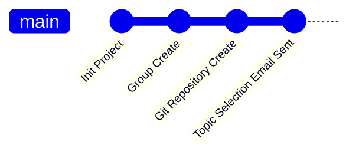

# :large_orange_diamond:COMP4107 Big Data Coursework Group
## :large_blue_diamond:Introduction
This is the repository for UNNC Big Data Coursework Group `(COMP4107)`.

The course information are:
- **Big Data**
- COMP4107
- UNNC 2023 Final Year Module

The members of this group are:
- :student:**Ran JI** 20217337
  :mailbox:scyrj1@nottingham.edu.cn
- :student:**Yik LAU** 20217531
  :mailbox:scyyl18@nottingham.edu.cn
- :student:**Jiarui LI** 20216422 `Group Leader`
  :mailbox:scyjl6@nottingham.edu.cn

This coursework is supervised by:

:man_teacher:Professor Zheng LU.

## :large_blue_diamond:Topic
Preference ranking:
- :bookmark:**BD07** An Optimised Classification for Flight Status
- :bookmark:**BD09** Analysis the Impact of Green Infrastructure on Carbon Monoxide Reduction
- :bookmark:**BD05** Climate Change Analysis in Brazil

Final decision: `waiting for professor assignment`

## :large_blue_diamond:TO DO

- [ ] :hourglass:Topic Preparing
  - [x] Send Topic Choose Email
  - [ ] Confirm Topic
  - [ ] Collect Topic Basic Information
  - [x] Team GitHub Init
  - [x] Team Chat Group Init

## :large_blue_diamond:Documents
### :small_blue_diamond:Coursework Specification
:file_folder:[Coursework for COMP4107 Big Data.pdf](./docs/Coursework%20for%20COMP4107%20Big%20Data.pdf) `Update: 2023/04/08`
### :small_blue_diamond:Templates
#### Report Template
:file_folder:[Conference-LaTeX-template.zip](./docs/Templates/Conference-LaTeX-template.zip) `Update: 2023/04/08` `LaTeX`

Related Document: :file_folder:[IEEEtran_HOWTO.pdf](./docs/Templates/IEEEtran_HOWTO.pdf)

#### Representation Slide Template
:file_folder:[CW presenation -Template.pptx](./docs/Templates/CW%20presenation%20-Template.pptx) `Update: 2023/04/08` `pptx`

### :small_blue_diamond:Cheatsheet
- :spiral_notepad:[Spark Cheatsheet](https://www.datacamp.com/cheat-sheet/pyspark-cheat-sheet-spark-in-python)
- :spiral_notepad:[Python Cheatsheet](https://www.pythoncheatsheet.org/)
- :spiral_notepad:[Pandas Cheatsheet](https://www.datacamp.com/cheat-sheet/pandas-cheat-sheet-for-data-science-in-python)
- :spiral_notepad:[Numpy Cheatsheet](https://www.datacamp.com/cheat-sheet/numpy-cheat-sheet-data-analysis-in-python)
- :spiral_notepad:[Matplotlib Cheatsheet](https://matplotlib.org/cheatsheets/)
- :spiral_notepad:[PyTorch Cheatsheet](https://pytorch.org/tutorials/beginner/ptcheat.html)
### :small_blue_diamond:Documentation
- :notebook:[Python Documentation `3.11.3`](https://docs.python.org/3/)
- :notebook:[Spark Documentation `3.3.2`](https://spark.apache.org/docs/latest/)
- :notebook:[PyTorch Documentation `2.0`](https://pytorch.org/docs/stable/index.html)

### :small_blue_diamond:Resource
#### ICON
- :framed_picture:[UNNC ICON](./imgs/UoN_Primary_Logo_RGB.png)

## :large_blue_diamond:Dataset
_wait for topic confirm_
## :large_blue_diamond:Methods
_wait for topic confirm_
## :large_blue_diamond:Reports
_wait for topic confirm_

>  

>    <a href="https://www.python.org/">
>      
>    </a>
>    <a href="https://spark.apache.org/">
>      
>    </a>
>    <a href="https://numpy.org/">
>      
>    </a>
>    <a href="https://www.kaggle.com/">
>      
>    </a>
>  
