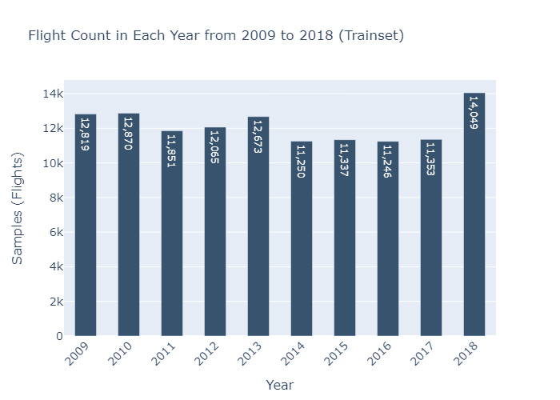
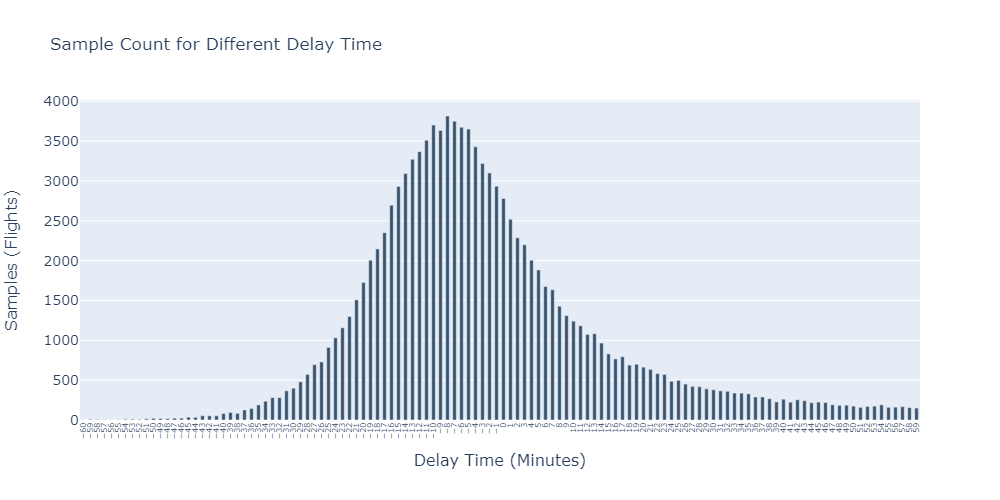
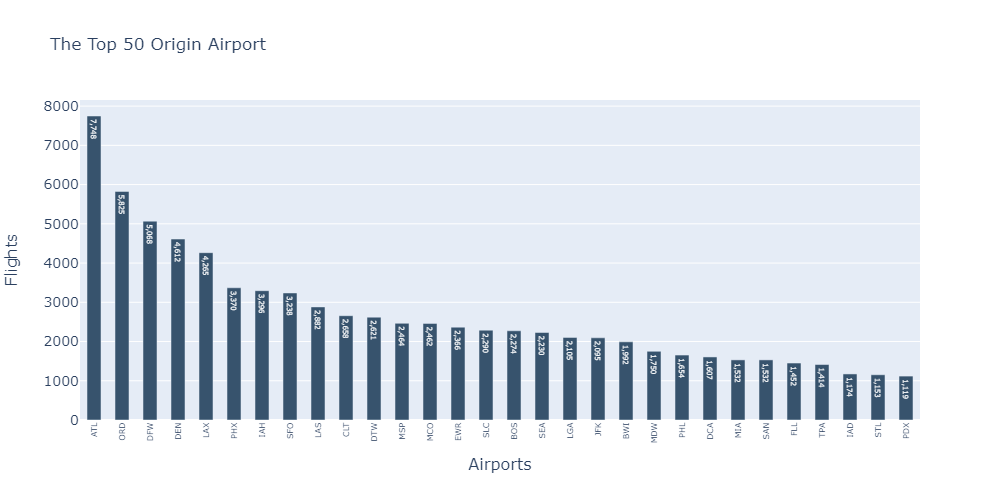
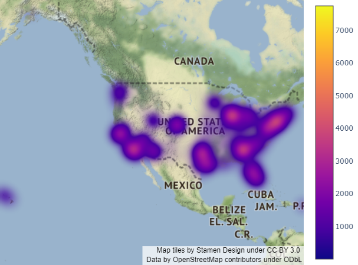
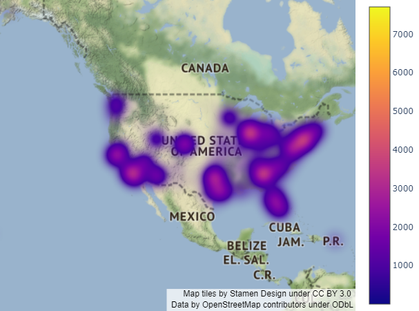
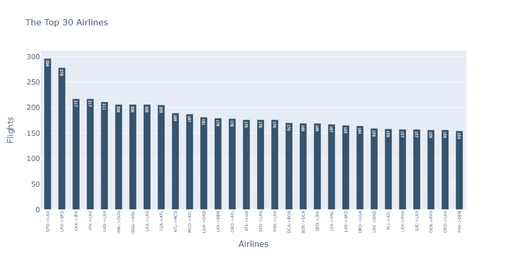
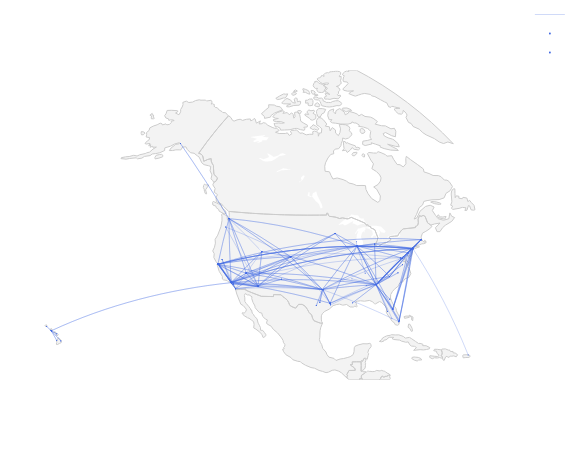

# Dataset Analysis

## Features
|Column|Table Token      |Type                |Description|
|:----:|:----------------|:-------------------|:----------|
|1     |FL_DATE          |`Date` (YYYY-MM-DD) |Flight Date |
|2     |OP_CARRIER       |`String`            |Unique Carrier Code. When the same code has been used by multiple carriers, a numeric suffix is used for earlier users, for example, PA, PA(1), PA(2). Use this field for analysis across a range of years. |
|3     |OP_CARRIER_FL_NUM|`Integer`           |An identification number assigned by US DOT to identify a unique airline (carrier). A unique airline (carrier) is defined as one holding and reporting under the same DOT certificate regardless of its Code, Name, or holding company/corporation.|
|4     |ORIGIN           |`String`            |Origin Airport|
|5     |DEST             |`String`            |Destination Airport|
|6     |CRS_DEP_TIME     |`Integer` (hhmm)    |CRS Departure Time (local time: hhmm) |
|7     |DEP_TIME         |`Integer` (hhmm)    |Actual Departure Time (local time: hhmm)|
|8     |DEP_DELAY        |`Integer`           |Difference in minutes between scheduled and actual departure time. Early departures show negative numbers.|
|9     |TAXI_OUT         |`Integer` (hhmm)    |Taxi Out Time, in Minutes|
|10    |WHEELS_OFF       |`Integer` (hhmm)    |Wheels Off Time (local time: hhmm)|
|11    |WHEELS_ON        |`Integer` (hhmm)    |Wheels On Time (local time: hhmm)|
|12    |TAXI_IN          |`Integer` (hhmm)    |Taxi In Time, in Minutes|
|13    |CRS_ARR_TIME     |`Integer` (hhmm)    |CRS Arrival Time (local time: hhmm)|
|14    |ARR_TIME         |`Integer` (hhmm)    |Actual Arrival Time (local time: hhmm)|
|15    |ARR_DELAY        |`Integer`           |Difference in minutes between scheduled and actual arrival time. Early arrivals show negative numbers.|
|16    |CANCELLED        |`Integer` (0,1)     |Cancelled Flight Indicator (1=Yes)|
|17    |CANCELLATION_CODE|`Char` (A,B,C,D)    |Specifies The Reason For Cancellation, A:Carrier, B:Weather, C:National Air System, D:Security|
|18    |DIVERTED         |`Integer` (0,1)     |Diverted Flight Indicator (1=Yes)|
|19    |CRS_ELAPSED_TIME |`Integer`           |CRS Elapsed Time of Flight, in Minutes|
|20    |ACTUAL_ELAPSED_TIME|`Integer`           |Elapsed Time of Flight, in Minutes|
|21    |AIR_TIME         |`Integer`           |Flight Time, in Minutes|
|22    |DISTANCE         |`Integer`           |Distance between airports (miles)|
|23    |CARRIER_DELAY    |`Integer`           |Carrier Delay, in Minutes|
|24    |WEATHER_DELAY    |`Integer`           |Weather Delay, in Minutes|
|25    |NAS_DELAY        |`Integer`           |National Air System Delay, in Minutes|
|26    |SECURITY_DELAY   |`Integer`           |Security Delay, in Minutes|
|27    |LATE_AIRCRAFT_DELAY|`Integer`           |Late Aircraft Delay, in Minutes|

## Samples
- **Total Samples**: 68,979,001
- **Total Files**: 11

## Train Dataset
- **Total Samples**: 121,513
- **Years**: `2009`, `2010`, `2011`, `2012`, `2013`, `2014`, `2015`, `2016`, `2017`, `2018`
- **Sample Number of Years**:
  |2009|2010|2011|2012|2013|2014|2015|2016|2017|2018|
  |:--:|:--:|:--:|:--:|:--:|:--:|:--:|:--:|:--:|:--:|
  |12,819|12,870|11,851|12,065|12,673|11,250|11,337|11,246|11,353|14,049|

  
- **Delay Samples**: 48,150 `(39.63%)`
  |-60|-59|-58|-57|-56|-55|-54|-53|-52|-51|-50|-49|-48|-47|-46|-45|-44|-43|-42|-41|-40|-39|-38|-37|-36|-35|-34|-33|-32|-31|-30|-29|-28|-27|-26|-25|-24|-23|-22|-21|-20|-19|-18|-17|-16|-15|-14|-13|-12|-11|-10|-9|-8|-7|-6|-5|-4|-3|-2|-1|0|1|2|3|4|5|6|7|8|9|10|11|12|13|14|15|16|17|18|19|20|21|22|23|24|25|26|27|28|29|30|31|32|33|34|35|36|37|38|39|40|41|42|43|44|45|46|47|48|49|50|51|52|53|54|55|56|57|58|59|
  |:--:|:--:|:--:|:--:|:--:|:--:|:--:|:--:|:--:|:--:|:--:|:--:|:--:|:--:|:--:|:--:|:--:|:--:|:--:|:--:|:--:|:--:|:--:|:--:|:--:|:--:|:--:|:--:|:--:|:--:|:--:|:--:|:--:|:--:|:--:|:--:|:--:|:--:|:--:|:--:|:--:|:--:|:--:|:--:|:--:|:--:|:--:|:--:|:--:|:--:|:--:|:--:|:--:|:--:|:--:|:--:|:--:|:--:|:--:|:--:|:--:|:--:|:--:|:--:|:--:|:--:|:--:|:--:|:--:|:--:|:--:|:--:|:--:|:--:|:--:|:--:|:--:|:--:|:--:|:--:|:--:|:--:|:--:|:--:|:--:|:--:|:--:|:--:|:--:|:--:|:--:|:--:|:--:|:--:|:--:|:--:|:--:|:--:|:--:|:--:|:--:|:--:|:--:|:--:|:--:|:--:|:--:|:--:|:--:|:--:|:--:|:--:|:--:|:--:|:--:|:--:|:--:|:--:|:--:|:--:|
  |2|8|6|4|3|3|9|10|8|15|21|18|17|23|23|36|33|54|53|53|81|95|84|126|145|189|236|281|281|366|399|479|572|694|729|911|1,031|1,157|1,299|1,508|1,725|2,006|2,147|2,351|2,696|2,930|3,094|3,271|3,367|3,511|3,702|3,633|3,815|3,750|3,674|3,651|3,428|3,219|3,100|2,934|2,781|2,519|2,287|2,198|2,006|1,883|1,674|1,635|1,428|1,310|1,241|1,182|1,074|1,083|965|830|767|794|689|700|663|635|582|572|486|497|451|422|418|391|379|366|360|338|337|328|289|289|267|226|261|223|254|243|216|225|219|191|184|186|174|159|170|174|190|159|161|167|155|150|

  

- **Origin Airport Count**: 358
  |ATL|ORD|DFW|DEN|LAX|PHX|IAH|SFO|LAS|CLT|DTW|MSP|MCO|EWR|SLC|BOS|SEA|LGA|JFK|BWI|MDW|PHL|DCA|MIA|SAN|FLL|TPA|IAD|STL|PDX|
  |:--:|:--:|:--:|:--:|:--:|:--:|:--:|:--:|:--:|:--:|:--:|:--:|:--:|:--:|:--:|:--:|:--:|:--:|:--:|:--:|:--:|:--:|:--:|:--:|:--:|:--:|:--:|:--:|:--:|:--:|
  |7,748|5,825|5,068|4,612|4,265|3,370|3,296|3,238|2,882|2,658|2,621|2,464|2,462|2,366|2,290|2,274|2,230|2,105|2,095|1,992|1,750|1,654|1,607|1,532|1,532|1,452|1,414|1,174|1,153|1,119|

  
  

- **Destination Airport Count**: 361
  |ATL|ORD|DFW|DEN|LAX|PHX|IAH|SFO|LAS|CLT|MSP|DTW|SLC|MCO|BOS|SEA|EWR|JFK|LGA|BWI|MDW|SAN|PHL|DCA|FLL|MIA|TPA|IAD|STL|BNA|
  |:--:|:--:|:--:|:--:|:--:|:--:|:--:|:--:|:--:|:--:|:--:|:--:|:--:|:--:|:--:|:--:|:--:|:--:|:--:|:--:|:--:|:--:|:--:|:--:|:--:|:--:|:--:|:--:|:--:|:--:|
  |7,707|5,723|5,015|4,572|4,255|3,487|3,362|3,155|2,967|2,638|2,536|2,530|2,394|2,386|2,321|2,309|2,295|2,065|2,003|1,927|1,750|1,663|1,631|1,561|1,473|1,465|1,390|1,252|1,162|1,129|
  

  
  

- **Flights Count**: 5,592
  |**Rank**|0|1|2|3|4|5|6|7|8|9|10|11|12|13|14|15|16|17|18|19|20|21|22|23|24|25|26|27|28|29|
  |:--:|:--:|:--:|:--:|:--:|:--:|:--:|:--:|:--:|:--:|:--:|:--:|:--:|:--:|:--:|:--:|:--:|:--:|:--:|:--:|:--:|:--:|:--:|:--:|:--:|:--:|:--:|:--:|:--:|:--:|:--:|
  |**Origin**|SFO|LAX|LAX|JFK|LAS|HNL|OGG|LAX|LGA|ATL|MCO|LGA|LAX|ORD|ATL|SFO|PHX|DCA|BOS|SFO|LIH|LAS|ORD|LAX|FLL|LAX|SJC|DEN|ORD|PHX|
  |**Destination**|LAX|SFO|JFK|LAX|LAX|OGG|HNL|LAS|ATL|MCO|ATL|ORD|DEN|ATL|LGA|LAS|LAX|BOS|DCA|JFK|HNL|SFO|LGA|ORD|ATL|PHX|LAX|PHX|LAX|DEN|
  |**Count**|296|278|217|217|211|206|206|206|205|189|187|181|179|178|176|176|176|170|169|169|167|165|164|159|158|157|157|156|156|154|

  
  

## Test Dataset
- **Total Samples**: 14,861